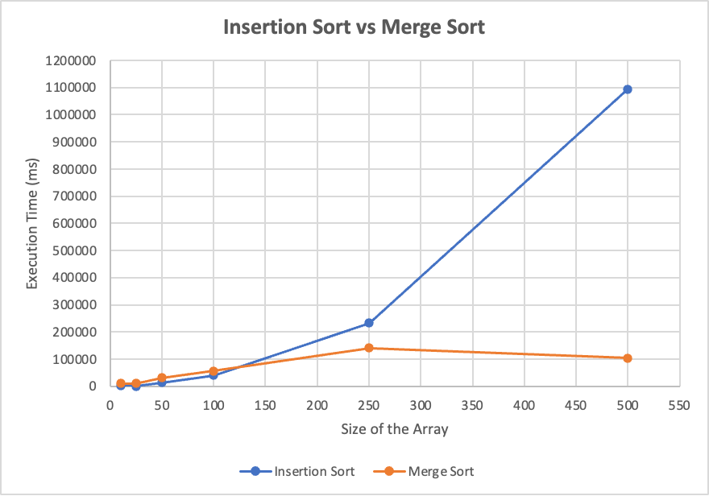

# MultiAlgorithm-Analysis

The executed code, outputted the running time of the both algorithms for all given array sizes. As execution time changes for every run and depends on specifications of the machine
and number of processes running in my machine. We repeated the same process three times and calculated the average of these execution times.

<pre>
Size of Array      |      Avg Execution Time (ms) of Insertion Sort      |      Avg Execution Time (ms) of Merge Sort  
    10                                  1542                                                       10263 
    25                                  922                                                        11416 
    50                                  13458                                                      31297 
    100                                 40541                                                      57222 
    250                                 232430                                                     141430 
    500                                 1093291                                                    104536 
</pre>

1. To find the value of “n” at which Merge Sort becomes better than Insertion Sort, we can look for a trend where Merge Sort's execution time is lower than that of Insertion Sort.
2. For 'n' equal to 10, 25, 50, 100 Insertion Sort is faster.
3. The point of intersection is at n= 123 at which the performance of both algorithms interchange.
4. For 'n' equal to 250 and 500, Merge Sort remains faster.

> Hence, Merge Sort becomes relatively better than Insertion Sort for sorting arrays of size 'n' when n > 123 based on the practical data.

